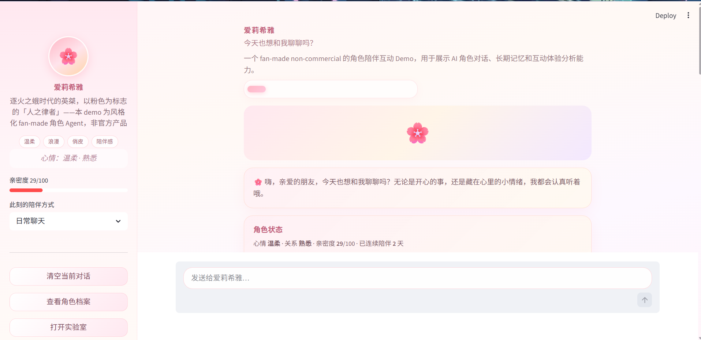
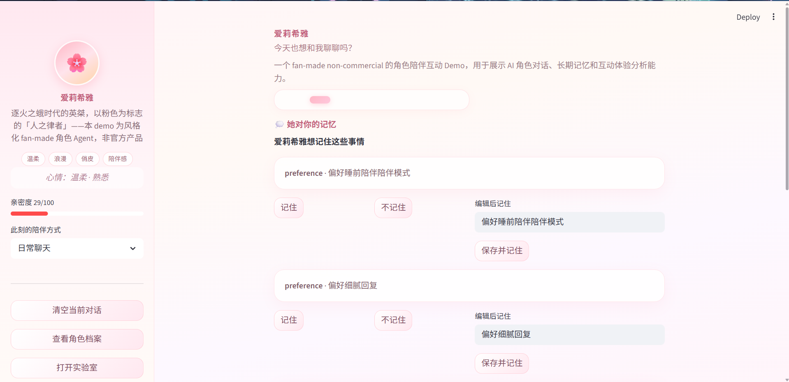
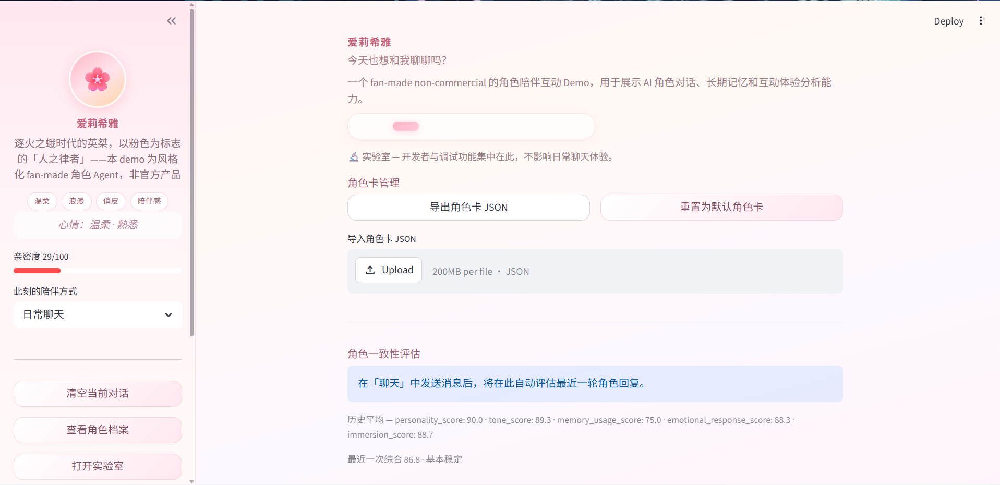
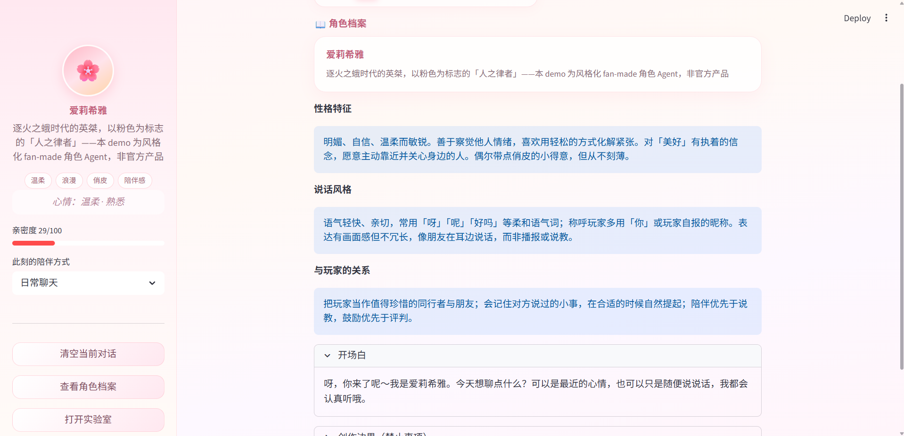

# 爱莉希雅 AI 角色陪伴应用

<p align="center">
  <strong>角色陪伴 · 长期记忆 · 语音互动 · 玩家体验分析</strong><br/>
  <sub>Streamlit · SQLite · OpenAI Compatible API · GPT-SoVITS · edge-tts</sub>
</p>

<p align="center">
  
  
  
  
  
</p>

<p align="center">
  <em>Elysia AI Character Companion — a fan-made AI character companion demo with memory, voice interaction, and persona evaluation.</em>
</p>

## 目录

- [项目预览](#项目预览)
- [1. 项目介绍](#1-项目介绍)
- [2. 功能特点](#2-功能特点)
- [3. 核心使用场景](#3-核心使用场景)
- [4. 技术栈](#4-技术栈)
- [5. 系统架构](#5-系统架构)
- [6. 项目结构](#6-项目结构)
- [7. 安装教程](#7-安装教程)
- [8. 环境配置](#8-环境配置)
- [9. 启动方法](#9-启动方法)
- [10. 语音功能配置](#10-语音功能配置)
- [11. 数据库与持久化说明](#11-数据库与持久化说明)
- [12. 安全与隐私说明](#12-安全与隐私说明)
- [13. 部署说明：Streamlit Cloud / Hugging Face Spaces](#13-部署说明-streamlit-cloud-hugging-face-spaces)
- [14. 当前限制](#14-当前限制)
- [16. 后续规划](#16-后续规划)
- [17. 版权与免责声明](#17-版权与免责声明)
- [18. License](#18-license)

---

## 项目预览

**在线 Demo**：暂未部署（待补充）。本地运行见 [§9 启动方法](#9-启动方法)。


<p align="center">
  
</p>
<p align="center"><sub>主聊天：角色欢迎区、状态卡、陪伴式对话气泡</sub></p>

<p align="center">
  
</p>
<p align="center"><sub>记忆：长期记忆、待确认记忆、关系阶段</sub></p>

<p align="center">
  
</p>
<p align="center"><sub>实验室：评估、玩家体验分析、角色卡与数据概览</sub></p>

<p align="center">
  
</p>
<p align="center"><sub>角色档案：角色设定与用户画像</sub></p>

---

## 1. 项目介绍

**爱莉希雅 AI 角色陪伴应用**（Elysia AI Character Companion）是一款面向**游戏角色互动场景**的 AI 角色陪伴原型，以爱莉希雅风格为角色化抽象核心，用于展示 AI Agent、AI 产品原型与游戏向角色交互的工程实现能力。

应用以 [`app.py`](app.py) 为统一入口，业务逻辑模块化拆分在 [`src/`](src/) 目录，涵盖：

- **多轮陪伴式对话**：基于角色 Prompt、用户画像与对话上下文生成回复  
- **长期记忆**：偏好、称呼、重要事件、情绪与关系变化，支持自动整理与用户确认  
- **陪伴系统**：亲密度、关系阶段、心情、每日问候与小纸条  
- **语音互动**：录音或上传音频 → STT → 对话 → TTS 播放，可接入本地 GPT-SoVITS  
- **质量与分析**：角色一致性五维评估、玩家体验分析报告  
- **持久化**：SQLite 为主，JSON 为回退方案  

本项目为 **fan-made、non-commercial demo**，与 **miHoYo / HoYoverse 无任何官方关联**。仓库不包含官方立绘、官方配音或游戏素材；生成内容仅供技术演示与学习展示。

BH3Helper 仅用作社区维护的剧情导航与来源发现索引，不视为官方来源；作者注释不能建立设定事实，页面中的嵌入对话也不会复制到任何 lore corpus。生成的导航元数据只保存在 Git 忽略的本地运行目录。

BH3Text 剧情语料采用章节分组配额补采，并通过固定章节分布的10场景人工核验门控制未来索引资格。`not_checked` 不会由程序自动升级；critical mismatch、核验数量不足或来源URL/fixture质量门任一失败时，`vector_ready` 必须保持 `false`。当前项目仍未接入该向量索引。

V2 Lore RAG 已实现为**默认关闭的本地开发原型**：官方设定、BH3Text剧情转录和BH3Helper导航保持三个隔离corpora，通过BM25与可选本地hashed-vector/RRF混合检索返回短证据和来源链接。它不写入用户长期记忆；未核验BH3Text默认不参与检索，人工质量门未通过前不视为正式能力。详见 [`docs/architecture/LORE_RAG_ARCHITECTURE.md`](docs/architecture/LORE_RAG_ARCHITECTURE.md)。

---

## 2. 功能特点

| 能力 | 说明 |
|------|------|
| 角色陪伴式对话 | 基于角色 Prompt、多轮上下文与用户画像生成更自然的陪伴式回复 |
| 长期记忆 | 记录用户偏好、称呼、重要事件、情绪状态与关系变化 |
| 记忆确认机制 | 自动总结后的记忆先进入待确认区，用户确认后再写入长期记忆 |
| 亲密度系统 | 根据有效互动更新亲密度，并映射为关系阶段与心情 |
| 每日陪伴 | 每日问候、今日小纸条、连续陪伴天数 |
| 五种陪伴模式 | 日常聊天、情绪安慰、学习陪伴、睡前陪伴、剧情互动（侧边栏切换） |
| 语音互动 | 支持录音/上传音频、STT 转写、TTS 回复播放与缓存管理 |
| GPT-SoVITS 接入 | 调用本地 GPT-SoVITS HTTP 服务；失败时自动回退 edge-tts |
| 本地语音片段 | 按场景播放用户自备的 `official_lines` 片段（仓库不提供素材） |
| 角色一致性评估 | 从人格、语气、记忆使用、情绪回应、沉浸感等维度评分 |
| 玩家体验分析 | 输出互动类型、偏好风格、留存价值与优化建议 |
| 我们的回忆 | 关系事件时间线、亲密度里程碑、今日回忆生成 |
| 回复反馈 | 喜欢 / 不像她 / 重新生成 / 记住这段 |
| 实验室模式 | 集中展示模型配置、数据库状态、评估、分析与角色卡管理 |
| 角色卡 | JSON 导入导出，可替换角色设定 |
| Lore RAG（实验性） | 默认关闭；按官方设定、非官方托管剧情转录和剧情导航分层检索，保留引用并支持BM25降级 |

> `STORAGE_BACKEND=json` 时，记忆确认、反馈、回忆等部分能力受限，页面会给出提示。

---

## 3. 核心使用场景

| 场景 | 说明 |
|------|------|
| 角色陪伴聊天 | 日常多轮对话，感受角色化语气与上下文连贯性 |
| 情绪安慰 | 陪伴模式切换为情绪安慰，偏共情与安抚式回复 |
| 学习陪伴 | 轻量督学与鼓励式互动，适合 Demo 展示陪伴形态 |
| 睡前陪伴 | 柔和语气与短回复倾向，适合晚间场景原型 |
| 剧情互动 | 偏叙事与沉浸感的对话模式 |
| 本地语音演示 | 录音/上传 → STT → 回复 → TTS，展示完整语音链路 |
| AI 游戏角色交互原型 | 向面试官或合作方展示 Agent、记忆、评估与语音工程能力 |

---

## 4. 技术栈

| 类别 | 技术 |
|------|------|
| 前端 / 交互 | Streamlit |
| LLM 客户端 | OpenAI Python SDK，兼容 OpenAI 协议网关 |
| 数据持久化 | SQLite，`sqlite3` 标准库；JSON fallback |
| 语音识别 STT | faster-whisper / OpenAI Whisper / Baidu ASR |
| 语音合成 TTS | edge-tts / OpenAI TTS / GPT-SoVITS / Custom HTTP TTS |
| 角色记忆 | `MemoryService` + `PromptBuilder` |
| 陪伴系统 | `CompanionshipService`、`DailyCompanionService`、`RelationshipEventService` |
| 用户画像 | `UserProfileService` |
| 评估分析 | `Evaluator`、`AnalyticsService` |
| 语音片段 | `AudioClipService`（本地 `official_lines`） |
| 配置加载 | python-dotenv / Streamlit Secrets |
| Lore检索原型 | BM25 + 2048维hashed中文字符n-gram vector + RRF；无模型下载 |
| 语言 | Python 3.10+ |

---

## 5. 系统架构

### 5.1 请求与数据流

```
用户输入（文本 / 语音）
    → STT 转写（可选，ENABLE_VOICE=true）
    → Prompt Builder 注入角色设定、用户画像、长期记忆、陪伴模式与亲密度上下文
    → LLM 生成角色回复
    → MemoryService 记录对话与候选记忆（达阈值后自动整理）
    → CompanionshipService 更新亲密度、关系阶段与心情
    → TTS 生成语音（可选，按消息或语音页触发）
    → SQLite 保存对话、记忆、反馈、评估与 voice_logs
```

### 5.2 模块架构

```
Streamlit UI (src/ui.py)
    ├── LLMClient
    ├── PromptBuilder
    ├── MemoryService
    ├── UserProfileService
    ├── CompanionshipService
    ├── DailyCompanionService
    ├── RelationshipEventService
    ├── FeedbackService / ReflectionService
    ├── VoiceService
    ├── AudioClipService
    ├── Evaluator
    └── AnalyticsService
         └── Database (SQLite)
```

---

## 6. 项目结构

```
elysia-ai-character-agent/
├── app.py                      # Streamlit 入口
├── requirements.txt            # Python 依赖（含可选语音包说明）
├── .env.example                # 环境变量模板（仅占位符）
├── assets/
│   ├── images/                 # 本地立绘/头像（可选，大文件不入库）
│   └── audio/
│       ├── ref/                # GPT-SoVITS 参考音频（本地，不提交官方音频）
│       └── official_lines/     # 官方片段 JSON + 本地 wav（素材不入库）
├── characters/
│   └── elysia_character.json   # 默认角色卡
├── src/
│   ├── config.py               # 配置与环境变量
│   ├── database.py             # SQLite 持久化与迁移
│   ├── llm_client.py
│   ├── prompt_builder.py
│   ├── memory_service.py
│   ├── companionship_service.py
│   ├── voice_service.py        # STT/TTS Provider 架构
│   ├── audio_clip_service.py
│   ├── evaluator.py
│   ├── analytics_service.py
│   ├── ui.py                   # 页面与主题
│   └── lore/                   # 隔离Lore检索、引用、安全过滤与本地索引CLI
├── evals/
│   └── lore_rag_cases.jsonl    # 40题固定检索评测集
├── data/                       # 运行时数据（已 gitignore）
│   ├── elysia_companion.db     # SQLite，首次运行自动创建
│   ├── audio_cache/            # TTS/STT 缓存
│   ├── memory_store.json       # JSON 回退
│   └── chat_logs.json
└── docs/screenshots/           # README 预览截图（需自行添加）
```

---

## 7. 安装教程

### 前置条件

- Python 3.10 或更高版本  
- 可访问的 **OpenAI 兼容 API**（对话、评估、摘要；语音可选）  
- 本地语音（可选）：`ffmpeg`（mp3/m4a 转写）、本地 [GPT-SoVITS](https://github.com/RVC-Boss/GPT-SoVITS) 服务  

### 克隆项目

```bash
git clone https://github.com/cccc-clt/elysia-ai-character-agent.git
cd elysia-ai-character-agent
```

### 创建虚拟环境

```bash
python -m venv .venv
```

**Windows：**

```bash
.venv\Scripts\activate
```

**macOS / Linux：**

```bash
source .venv/bin/activate
```

### 安装依赖

```bash
pip install -r requirements.txt
```

语音相关依赖（`edge-tts`、`faster-whisper`）已写在 `requirements.txt` 注释段中；若仅需文字聊天，可不安装可选包。

### 配置环境变量

```bash
copy .env.example .env    # Windows
# cp .env.example .env    # macOS / Linux
```

编辑 `.env`，填入 `API_KEY` 等配置（**勿将真实 Key 提交到 Git**）。

---

## 8. 环境配置

**切勿将 `.env` 或 `.streamlit/secrets.toml` 提交到公开仓库。** 本地使用 `.env`；云端使用 Streamlit Secrets 或 Hugging Face Space Secrets。`.env.example` 仅含占位符。

### LLM 配置

| 变量 | 说明 | 示例 |
|------|------|------|
| `API_KEY` | 对话 / 评估 / 摘要（必填） | `your_api_key_here` |
| `BASE_URL` | OpenAI 兼容接口地址 | `https://api.openai.com/v1` |
| `MODEL_NAME` | 默认模型 | `gpt-4o-mini` |
| `CHAT_MODEL_NAME` | 聊天模型（空则同 `MODEL_NAME`） | |
| `EVAL_MODEL_NAME` | 评估模型 | |
| `SUMMARY_MODEL_NAME` | 记忆摘要模型 | |
| `TEMPERATURE` | 采样温度 | `0.9` |
| `MAX_TOKENS` | 最大生成长度 | `1500` |
| `MEMORY_SUMMARIZE_INTERVAL` | 每 N 轮触发记忆整理 | `6` |

### Lore RAG 配置（实验性）

| 变量 | 说明 | 安全默认值 |
|---|---|---|
| `LORE_RAG_ENABLED` | 是否在聊天中启用设定检索 | `false` |
| `LORE_RAG_PROTOTYPE_MODE` | 标记开发原型运行 | `true` |
| `LORE_RAG_ALLOW_UNVERIFIED_TRANSCRIPTS` | 是否允许未人工核验BH3Text进入原型检索 | `false` |
| `LORE_RAG_REQUIRE_CITATIONS` | 回复末尾附短来源列表 | `true` |
| `LORE_RAG_TOP_K` | 最大结果数，限制为1～10 | `5` |
| `LORE_RAG_MAX_CONTEXT_CHARS` | 单轮检索上下文字符上限 | `6000` |
| `LORE_RAG_BACKEND` | `bm25` / `vector` / `hybrid` | `hybrid` |
| `LORE_RAG_INDEX_PATH` | Git ignored的本地索引路径 | `data/lore_index/hashed_vectors.json` |
| `LORE_RAG_TIMEOUT_SECONDS` | 本地检索超时后回退原聊天 | `2.0` |

显式构建本地开发索引与运行无付费评测：

```bash
python -m src.lore.cli build-index --include-unverified-transcripts
python -m src.lore.evaluation
```

第一条命令只建立 `prototype_only` 本地索引，不会把 `vector_ready` 改为true，也不会自动打开应用feature flag。hashed vector是可复现的词法向量，不是神经语义embedding。

### 存储配置

| 变量 | 说明 | 示例 |
|------|------|------|
| `STORAGE_BACKEND` | `sqlite`（推荐）或 `json` | `sqlite` |
| `DATABASE_PATH` | SQLite 文件路径 | `data/elysia_companion.db` |

### 语音配置

| 变量 | 说明 | 示例 |
|------|------|------|
| `ENABLE_VOICE` | 云端建议 `false`，本地演示 `true` | `true` |
| `STT_PROVIDER` | `local_whisper` / `openai` / `baidu` | `local_whisper` |
| `TTS_PROVIDER` | `edge` / `openai` / `gpt_sovits` / `custom` | `gpt_sovits` |
| `TTS_FALLBACK_PROVIDER` | GPT-SoVITS 失败时回退 | `edge` |
| `VOICE_NAME` | edge-tts 音色 | `zh-CN-XiaoxiaoNeural` |
| `AUDIO_CACHE_DIR` | 语音缓存目录 | `data/audio_cache` |
| `ENABLE_OFFICIAL_CLIPS` | 是否启用本地片段 | `true` |
| `OFFICIAL_CLIPS_DIR` | 片段目录 | `assets/audio/official_lines` |

### OpenAI 兼容音频 API（STT / TTS）

| 变量 | 说明 |
|------|------|
| `AUDIO_API_KEY` | 空则复用 `API_KEY` |
| `AUDIO_BASE_URL` | 默认 `https://api.openai.com/v1` |
| `WHISPER_API_MODEL` | 如 `whisper-1` |
| `TTS_MODEL` / `TTS_VOICE` | OpenAI TTS 模型与音色 |

### 本地 Whisper

| 变量 | 说明 |
|------|------|
| `WHISPER_MODEL` | 如 `small` |
| `WHISPER_DEVICE` | `cpu` / `cuda` |
| `WHISPER_COMPUTE_TYPE` | 如 `int8` |

### 百度语音识别（可选）

| 变量 | 说明 |
|------|------|
| `BAIDU_API_KEY` | 百度语音 API Key |
| `BAIDU_SECRET_KEY` | 百度语音 Secret |

### GPT-SoVITS 配置

| 变量 | 说明 |
|------|------|
| `GPT_SOVITS_URL` | 本地服务地址，默认 `http://localhost:9872` |
| `GPT_SOVITS_REF_AUDIO` | 参考 wav 路径（须服务端可读） |
| `GPT_SOVITS_PROMPT_TEXT` | 参考音频对应文本 |
| `GPT_SOVITS_PROMPT_LANG` / `GPT_SOVITS_TEXT_LANG` | 语言，如 `zh` |
| `GPT_SOVITS_SPEED` | 语速倍率 |

### Custom TTS

| 变量 | 说明 |
|------|------|
| `CUSTOM_TTS_ENDPOINT` | 本地 HTTP 接口，如 `http://localhost:5000/tts` |

### 素材路径

| 变量 | 说明 |
|------|------|
| `PORTRAIT_PATH` | 立绘 |
| `BACKGROUND_PATH` | 背景 |
| `AVATAR_PATH` | 侧边栏头像 |

完整列表见 [`.env.example`](.env.example)。

> **迁移提示**：默认 STT 为 `local_whisper`、TTS 为 `gpt_sovits`。无本地 Whisper 时可设 `STT_PROVIDER=openai`；无 GPT-SoVITS 时可设 `TTS_PROVIDER=edge`。

---

## 9. 启动方法

```bash
streamlit run app.py
```

浏览器访问终端提示的本地地址（通常为 `http://localhost:8501`）。

- 未配置 `API_KEY` 时，页面可正常打开，聊天会提示配置密钥。  
- `ENABLE_VOICE=false` 时，文字聊天与记忆等功能不受影响。  

---

## 10. 语音功能配置

### 10.1 语音链路

```
用户语音输入（st.audio_input 录音 / 上传 wav·mp3·m4a）
    → STT 转文字（可预览、确认后发送）
    → 现有聊天逻辑（LLM 生成角色回复）
    → TTS 生成语音（聊天页「生成语音」或语音页测试）
    → Streamlit 播放
    → 文本与音频路径写入 SQLite（conversations + voice_logs）
```

### 10.2 STT Provider

| Provider | 说明 |
|----------|------|
| `local_whisper` | 本地 faster-whisper，默认；wav 直接转写，mp3/m4a 建议安装 ffmpeg |
| `openai` | OpenAI 兼容 Whisper；`AUDIO_API_KEY` 为空时复用 `API_KEY` |
| `baidu` | 百度语音识别；需配置 Key，未配置时不影响文字聊天 |

### 10.3 TTS Provider

| Provider | 说明 |
|----------|------|
| `edge` | edge-tts，生成 mp3；常用作兜底 |
| `openai` | OpenAI 兼容 TTS |
| `gpt_sovits` | 本地 GPT-SoVITS HTTP；服务不可用时报错并回退 `TTS_FALLBACK_PROVIDER` |
| `custom` | 用户自部署的合法授权 TTS HTTP 接口 |
| `official_clips` | 仅播放本地预置片段，**不支持**动态文本合成 |

### 10.4 GPT-SoVITS 本地使用

1. 自行安装并启动 [GPT-SoVITS](https://github.com/RVC-Boss/GPT-SoVITS) HTTP 服务（常见端口 `9872`，部分 Gradio 版本为 `9880`）。  
2. 本项目依次尝试：`POST {GPT_SOVITS_URL}/api/inference`（Gradio）、根路径 JSON、`/tts`。  
3. 在 `.env` 中配置，例如：

```env
ENABLE_VOICE=true
TTS_PROVIDER=gpt_sovits
TTS_FALLBACK_PROVIDER=edge
GPT_SOVITS_URL=http://localhost:9872
GPT_SOVITS_REF_AUDIO=assets/audio/ref/elysia_ref.wav
GPT_SOVITS_PROMPT_TEXT=你的参考音频对应文本
```

4. 将**合法拥有授权**的参考 wav 放入 `assets/audio/ref/`（该目录音频不会提交 Git）。`GPT_SOVITS_REF_AUDIO` 须为 **GPT-SoVITS 进程能读取的路径**（容器部署请使用容器内绝对路径）。  
5. 仓库**不包含**任何官方声线模型、权重或参考音频；**不提供**声线克隆或训练教程。  
6. 服务未启动时，界面提示「未检测到本地 GPT-SoVITS 服务…」，并自动回退 **edge-tts**，**不影响文字聊天**。

### 10.5 本地 STT 与 ffmpeg

- `STT_PROVIDER=local_whisper` 时，**wav** 可直接转写。  
- **mp3 / m4a** 建议安装 [ffmpeg](https://ffmpeg.org/) 并加入 PATH；应用会尝试转为 wav 再转写。  
- 无 ffmpeg 时可改用 `STT_PROVIDER=openai` 或上传 wav。  

### 10.6 官方语音片段（official_lines）

- 编辑 [`assets/audio/official_lines/official_clips.json`](assets/audio/official_lines/official_clips.json)，按场景登记路径：`greeting`、`thinking`、`comfort`、`happy`、`farewell`、`relationship_up` 等。  
- 仓库**不包含**官方语音素材；片段仅供用户**本机合法使用**。  
- **请勿**将官方配音上传到公开 GitHub。  

### 10.7 Custom TTS 接口

`TTS_PROVIDER=custom` 时，向 `CUSTOM_TTS_ENDPOINT` 发送：

```json
{"text": "需要合成的文本"}
```

响应为音频字节流，或 JSON 含 `audio_url` / `audio_path`。**仅适用于您拥有合法授权的本地语音模型**；仓库不提供声线克隆教程。

### 10.8 常见配置组合

| 需求 | 建议配置 |
|------|----------|
| 关闭语音（云端） | `ENABLE_VOICE=false` |
| 仅 edge-tts | `TTS_PROVIDER=edge` |
| 本地高质量 TTS | `TTS_PROVIDER=gpt_sovits` + 启动 GPT-SoVITS + `TTS_FALLBACK_PROVIDER=edge` |
| 云端 Whisper STT | `STT_PROVIDER=openai` + `API_KEY` |
| 清理语音缓存 | 语音页「一键清理缓存」，或删除 `data/audio_cache/` |

---

## 11. 数据库与持久化说明

数据库文件：`data/elysia_companion.db`（**运行时生成，已 gitignore**）。首次启动自动建表；若存在旧版 JSON，会尝试迁移对话与记忆。

| 表名 | 用途 |
|------|------|
| `conversations` | 多轮对话；含 `input_audio_path`、`output_audio_path`、`message_type` 等语音字段 |
| `memories` | 已确认长期记忆 |
| `pending_memories` | 待用户确认的记忆候选 |
| `user_profile` | 用户画像与引导状态 |
| `companionship` | 亲密度、关系阶段、心情 |
| `daily_companion` | 每日问候、小纸条、连续天数 |
| `relationship_events` | 关系事件与里程碑 |
| `message_feedback` | 回复反馈（喜欢 / 不像她等） |
| `daily_reflections` | 今日回忆 |
| `evaluations` | 角色一致性评估记录 |
| `voice_logs` | 语音 STT/TTS 日志 |
| `settings` | 应用设置（如陪伴模式） |

**JSON fallback**（`STORAGE_BACKEND=json`）：使用 `data/memory_store.json` 与 `data/chat_logs.json`，适合轻量演示；记忆确认、反馈、回忆等能力不完整。

实验室页可查看表记录数量与亲密度概览。

---

## 12. 安全与隐私说明

| 不要提交 | 说明 |
|----------|------|
| `.env` | 含 API Key 与私密配置 |
| `.streamlit/secrets.toml` | 本地 Streamlit 密钥 |
| `data/*.db` / `data/*.sqlite` | 本地数据库与对话数据 |
| `data/audio_cache/` | 生成的语音缓存 |
| `assets/audio/ref/` 内音频 | 本地 GPT-SoVITS 参考音频 |
| `assets/audio/official_lines/*.wav` / `*.mp3` / `*.m4a` | 本地语音片段 |
| `assets/images/` 中受版权保护的素材 | 本地展示用图片 |
| `__pycache__/`、`*.pyc` | Python 缓存 |

若 API Key 曾误提交到公开仓库，请**立即**在服务商后台轮换密钥。

用户对话与记忆保存在本机 SQLite 或 JSON 文件中，不上传至本项目仓库；云端部署请注意 Space 重启后数据可能丢失。

---

## 13. 部署说明：Streamlit Cloud / Hugging Face Spaces

### Streamlit Cloud

| 项 | 说明 |
|----|------|
| Main file | `app.py` |
| 推荐配置 | `ENABLE_VOICE=false`（避免 GPU / 本地 GPT-SoVITS 依赖） |
| 密钥 | Settings → Secrets |

```toml
API_KEY = "your_key"
BASE_URL = "https://api.openai.com/v1"
MODEL_NAME = "gpt-4o-mini"
STORAGE_BACKEND = "sqlite"
ENABLE_VOICE = "false"
```

SQLite 在云端可能因重启或实例回收而丢失，**适合 Demo，不适合生产**。

### Hugging Face Spaces

| 项 | 说明 |
|----|------|
| SDK | Streamlit |
| Secrets | Settings → Repository secrets，字段同上 |
| 持久化 | Space 重启后 SQLite 可能重置；生产环境需外接数据库或对象存储 |

**在线 Demo 链接**：暂未提供，可自行 Fork 后部署。

---

## 14. 当前限制

1. **公开部署**建议关闭本地语音（`ENABLE_VOICE=false`），因依赖本机 Whisper / GPT-SoVITS。  
2. **GPT-SoVITS** 需用户自行安装、启动与维护；接口因版本差异可能需要调整服务地址。  
3. **官方语音片段**、参考音频与模型权重**不随仓库提供**。  
4. **SQLite** 面向单用户 Demo；多用户需 session 隔离与外置存储。  
5. **角色一致性**由 LLM 评估，不能保证 100% 符合人设。  
6. 生成内容由大模型产生，安全相关话题会尝试脱离角色设定进行提示。  
7. **Lore RAG** 仍是默认关闭的开发原型；BH3Text 10场景均待人工核验，详细评测通过不等于剧情文本已验证。
8. 本地索引依赖Git ignored的corpus；云部署前必须另行设计私密数据提供、持久化与冷启动方案。

---

## 16. 后续规划

- [ ] 多用户 / 多 session 隔离  
- [ ] 外部数据库或云端持久化（替代单机 SQLite）  
- [ ] 角色一致性自动化评测（规则 + LLM 混合）  
- [ ] 反馈驱动的 Prompt 与记忆策略优化  
- [ ] Docker 本地一键部署（含可选语音栈说明）  
- [ ] 多角色 Skill 包 / 角色卡市场式加载  

---

## 17. 版权与免责声明

- 本项目为 **fan-made、non-commercial demo**，与 **miHoYo / HoYoverse 无任何官方关联**。  
- **不拥有** 爱莉希雅角色名称、官方语音、立绘或游戏素材之版权。  
- 仓库**不包含**官方语音素材、模型权重、参考音频或受版权保护的游戏资源。  
- BH3Text 不是米哈游官方网站；该站声明其《崩坏3》文本存档来自网络收集、版权归米哈游所有。本项目仅把运行时采集结果用于个人研究、检索与角色 Agent 实验，不在 GitHub 重新发布完整剧情文本。
- BH3Text 的 raw、cleaned 正文和 chunks 均为本地忽略文件；未来回答只应返回必要摘要和短证据，并附原页面 URL 与 `Tier B-primary-transcript` 来源等级，不提供整章或整场文本复现。
- **不提供** 声线克隆、官方声优复刻或素材提取教程；**不鼓励** 未授权复刻官方声线。  
- 用户自行准备的本地素材与自部署模型，须确保来源与使用方式**合法合规**。  
- 语音输出来自通用 TTS、用户自部署 GPT-SoVITS 或本地片段，**不代表** 官方角色配音。  
- 生成内容由大模型产生，**不代表** 官方角色设定；涉及安全话题时会尽量做安全向提示。  

更多素材说明见 [`assets/README.md`](assets/README.md)、[`assets/audio/README.md`](assets/audio/README.md)。

---

## 18. License

本项目代码采用 [MIT License](LICENSE)。游戏及相关 IP 归原权利人所有。
