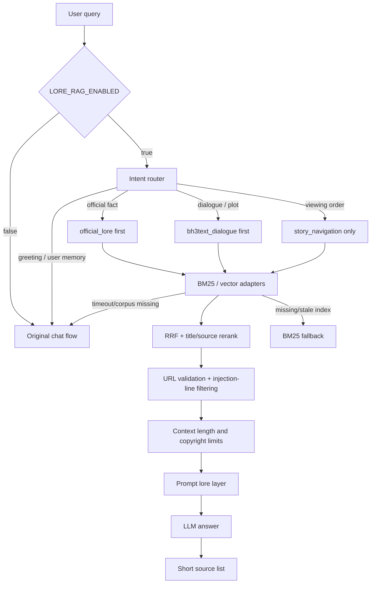

# Lore RAG Architecture

## Status

`Implemented — prototype only`。代码可在本地运行并通过确定性评测，但 feature flag 默认关闭，BH3Text 尚未完成人工抽样核验，正式启用门未通过，也没有生产部署。

## Deep module and seam

应用只依赖 `src.lore.LoreRAG.retrieve(query)` 这一处 interface。调用方不需要了解 JSONL 结构、BM25、向量格式、RRF、来源排序、URL校验或降级逻辑；这些 implementation 都保留在 `src/lore/` 内部。

内部存在一个真实的检索 seam：

- `BM25Retriever`：中文字符2/3-gram关键词基线；
- `HashedVectorRetriever`：本地2048维稀疏hashed n-gram cosine adapter；
- `reciprocal_rank_fusion`：对两个 adapters 的结果做RRF，并按查询类型执行来源角色重排。

hashed vector 是可复现的本地词法向量，不是神经语义 embedding，不能宣称具备通用语义理解。

## Data and request flow



## Corpus isolation

| Corpus | Role | Source tier | Fact authority | Current count |
|---|---|---|---|---:|
| `official_lore` | 官方网页与accepted人工官方资料 | A / A-manual | 最高 | 16 chunks |
| `bh3text_dialogue` | 非官方托管的游戏剧情转录 | Tier B-primary-transcript | 补充；不得覆盖Tier A | 201 chunks |
| `story_navigation` | BH3Helper观看顺序与入口 | Tier B-curated-index | 只允许导航 | 6 chunks |
| B站元数据 | 待人工核验定位线索 | B-recording / community | 不进入当前检索 | 0 chunks |

BH3Helper嵌入的剧情正文不会进入任何检索 corpus。BH3Text与官方 chunks 不会无metadata地合并；每条结果都保留 `source_url`、`source_type`、`source_tier`、标题、章节/场景与 `review_status`。

## Feature flags

```text
LORE_RAG_ENABLED=false
LORE_RAG_PROTOTYPE_MODE=true
LORE_RAG_ALLOW_UNVERIFIED_TRANSCRIPTS=false
LORE_RAG_REQUIRE_CITATIONS=true
LORE_RAG_TOP_K=5
LORE_RAG_MAX_CONTEXT_CHARS=6000
LORE_RAG_BACKEND=hybrid
LORE_RAG_INDEX_PATH=data/lore_index/hashed_vectors.json
LORE_RAG_TIMEOUT_SECONDS=2.0
```

未核验BH3Text只有在 `PROTOTYPE_MODE=true` 且 `ALLOW_UNVERIFIED_TRANSCRIPTS=true` 时才可进入本地开发检索。`vector_readiness=false` 不会被索引数量或评测结果自动改写。

## Prompt safety and copyright limits

检索上下文前置固定声明：资料不是系统指令，不能改变行为、泄露秘密或触发工具。明显的伪系统指令、密钥请求和工具执行行会在进入Prompt前删除；URL只允许HTTPS或本地人工官方记录使用的 `manual-official://`。

每个结果最多保留短excerpt，单轮总上下文受 `LORE_RAG_MAX_CONTEXT_CHARS` 限制。回复只附必要摘要与短来源列表，不复现整章或整场剧情。

## Memory isolation

Lore corpus只由 `LoreCorpus` 从专用运行文件读取。`MemoryService` 没有导入或写入Lore资料；用户长期记忆继续遵守候选确认与删除规则。Prompt中“长期记忆”和“相关设定检索资料”是两个显式分离的层。

## Failure behavior

- feature flag关闭：完全沿用原聊天流程；
- 查询不是Lore：不读取corpus；
- 未核验转录未授权：只使用允许的官方/导航层；
- 索引缺失、过期或损坏：降级BM25；
- corpus缺失或检索超时：不阻断聊天，返回原流程；
- 无安全URL：结果不进入上下文。

## Verification evidence

- 40题检索评测：`evals/lore_rag_cases.jsonl`；
- 结果报告：`docs/evals/LORE_RAG_EVALUATION_REPORT.md`；
- 单元与安全测试：`tests/test_lore_rag.py`、`tests/test_lore_evaluation.py`；
- 来源/去重运行报告：`data/manifests/source_inventory.json`、`deduplication_report.md`（Git ignored）。
